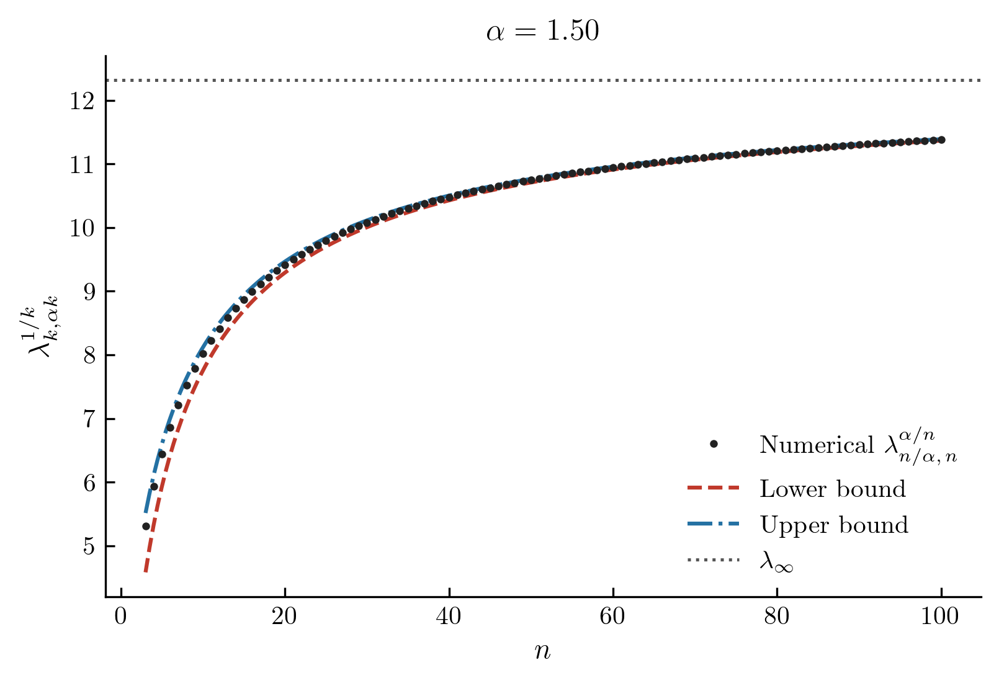
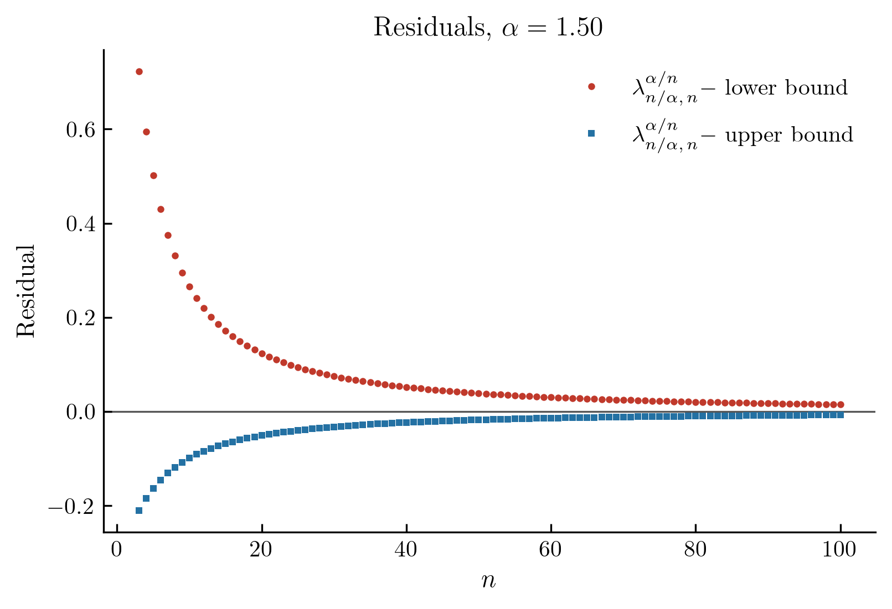
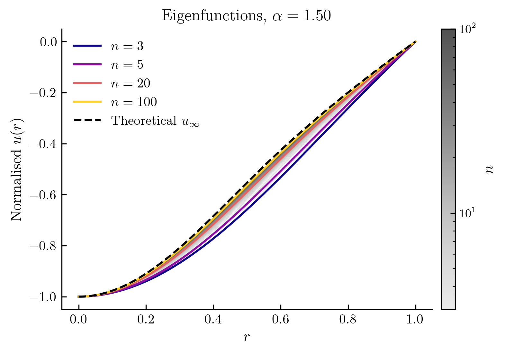
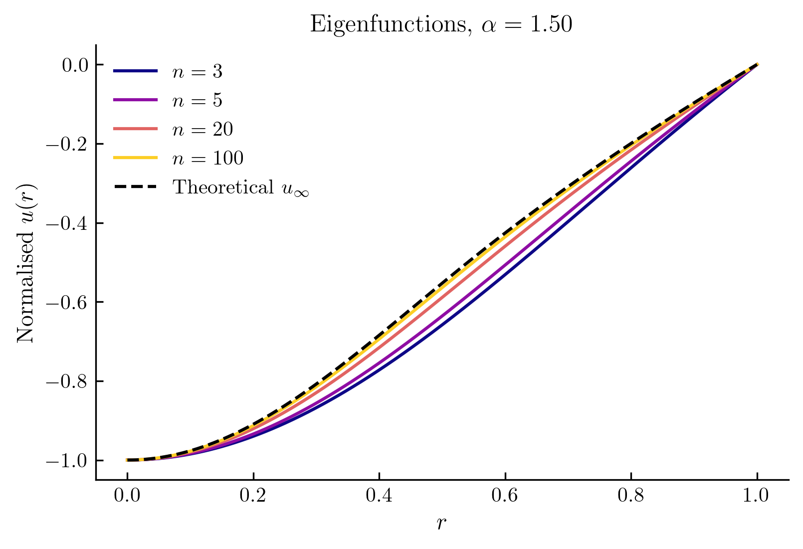
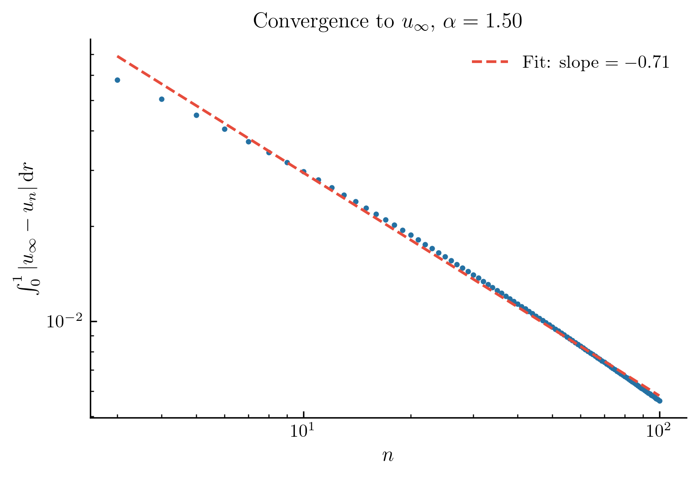

# $k$-Hessian Eigenvalue Problem — Numerical Study

This repository contains the numerical component of an ongoing project studying
the first eigenvalue of the $k$-Hessian operator on the unit ball in $\mathbb{R}^n$,
and the rate at which it converges to a known theoretical limit as $n, k \to \infty$.

---

## Mathematical Background

### The Operator

The $k$-Hessian operator $S_k(D^2 u)$ is defined as the $k$-th elementary symmetric
polynomial of the eigenvalues of the Hessian matrix $D^2 u$ of a function $u$.
Concretely, if $\lambda_1, \ldots, \lambda_n$ are the eigenvalues of $D^2 u$, then

$$S_k(D^2 u) = \sum_{1 \le i_1 < \cdots < i_k \le n} \lambda_{i_1} \cdots \lambda_{i_k}.$$

This family interpolates between the Laplacian ($k = 1$) and the Monge–Ampère
operator ($k = n$).

### The Eigenvalue Problem

We study radially symmetric solutions $u = u(r)$ on the unit ball $B \subset \mathbb{R}^n$
satisfying

$$S_k(D^2 u) = \lambda \, S_k(u \, I), \quad u\big|_{\partial B} = 0, \quad u(0) = -1,$$

where $I$ is the identity matrix and $\lambda > 0$ is the eigenvalue. The condition
$S_k(u \, I) = \binom{n}{k} |u|^k$ for radial $u$ makes this a nonlinear spectral
problem. We denote the first eigenvalue by $\lambda_{k,n}$.

### The Parameter $\alpha = n/k$

All asymptotic behaviour is governed by the ratio

$$\alpha = \frac{n}{k} \in (1, \infty).$$

We hold $\alpha$ fixed and study $\lambda_{k,\alpha k}^{1/k}$ as $k \to \infty$.
The normalisation by $1/k$ in the exponent is necessary: without it the eigenvalue
grows super-exponentially and carries no finite limit.

---

## Theoretical Results

### Asymptotic Limit

As $k \to \infty$ with $\alpha = n/k$ fixed, the renormalised eigenvalue converges
to a closed-form limit:

$$\lambda_\infty(\alpha) = \alpha^2 \left(\frac{2}{\alpha}\right)^{2/(2-\alpha)} \left(\frac{\alpha}{\alpha - 1}\right)^{\alpha - 1}.$$

The special case $\alpha = 2$ (corresponding to $k = n/2$, the $p = 1$ Monge–Ampère
regime) gives $\lambda_\infty(2) = 8e$.

### Upper and Lower Bounds

We derive explicit analytic bounds

$$\ell_k(n) \;\le\; \lambda_{k,n}^{1/k} \;\le\; u_k(n)$$

valid for all finite $n$ and $k$, both converging to $\lambda_\infty(\alpha)$ as
$k \to \infty$. The lower bound arises from a combinatorial estimate on the
$k$-Hessian; the upper bound is obtained by testing against a specific radial
function $u_0(r, \alpha)$ (described below) via the Rayleigh quotient.

### The Limit Eigenfunction

The eigenfunctions $u_{k,n}(r)$ converge in $L^1[0,1]$ to the function

$$u_0(r, \alpha) = \begin{cases} -\exp\left(-\dfrac{\alpha}{2 r_\alpha^2} r^2\right) & r \le r_\alpha, \\ \dfrac{2}{\sigma} e^{-\alpha/2} \left(r^\sigma - 1\right) & r > r_\alpha. \end{cases}$$

where $\sigma = 2 - \alpha$ and $r_\alpha = (\alpha/2)^{1/\sigma}$ is the junction
point. This function is $C^1$ and is used both as the test function in the upper
bound and as the theoretical prediction for the shape of the eigenfunction.

---

## Numerical Results ($\alpha = 1.5$)

The plots below are shown for the representative value $\alpha = 1.5$.

### Eigenvalue Convergence and Bounds

Numerical values of $\lambda_{k,n}^{1/k}$ (black dots) plotted alongside the
analytic lower bound (red dashed), upper bound (blue dash-dot), and the
asymptotic limit $\lambda_\infty$ (grey dotted).

Both bounds sandwich the numerical data throughout, confirming their validity for
finite $n$. All three quantities converge to $\lambda_\infty$ as $n \to \infty$.

### Bound Tightness (Residuals)

The signed gaps $\lambda_{k,n}^{1/k} - \ell_k$ and $\lambda_{k,n}^{1/k} - u_k$,
showing how close the bounds are to the true eigenvalue. Positive values confirm
the numerical eigenvalue lies strictly between the two bounds.

### Eigenfunction Convergence

All computed radial eigenfunctions $u_{k,n}(r)$ (grey gradient, darker = larger $n$),
with four selected values highlighted in colour and the theoretical limit $u_0$
overlaid as a dashed black curve. The colorbar uses a logarithmic scale reflecting
the $k^{-1}$ rate of convergence.

The four highlighted values alone, for clarity:

### Rate of Convergence to $u_0$

The $L^1[0,1]$ distance $\|u_{k,n} - u_0\|_1$ plotted against $n$ on a
log-log scale, with a power-law line of best fit. The slope of the fit gives
the convergence exponent.

---

## How the Computation Works

The numerical eigenvalue $\lambda_{k,n}$ is computed by solving the radial ODE
as a boundary value problem (BVP) on $[0,1]$, with $\lambda$ treated as an
additional unknown determined by the three boundary conditions
$u'(0) = 0$, $u(0) = -1$, $u(1) = 0$.

To reach large $n$ reliably, we use **continuation**: starting from a small
value of $n$ where the BVP is easy to solve, each converged solution is used as
the initial guess for the next, slightly larger $n$. Whenever a step fails, the
interval is automatically subdivided until either convergence is achieved or the
step falls below a prescribed minimum size.

The analytic bounds are evaluated by numerical quadrature of the Rayleigh-quotient
integrals, with careful log-scale arithmetic to avoid overflow at large $n$ and $k$.

---

## Running the Computation

All parameters (the values of $\alpha$, the maximum $n$, and the output file)
are set at the top of `run.py`. Running that file generates the data and all plots.
